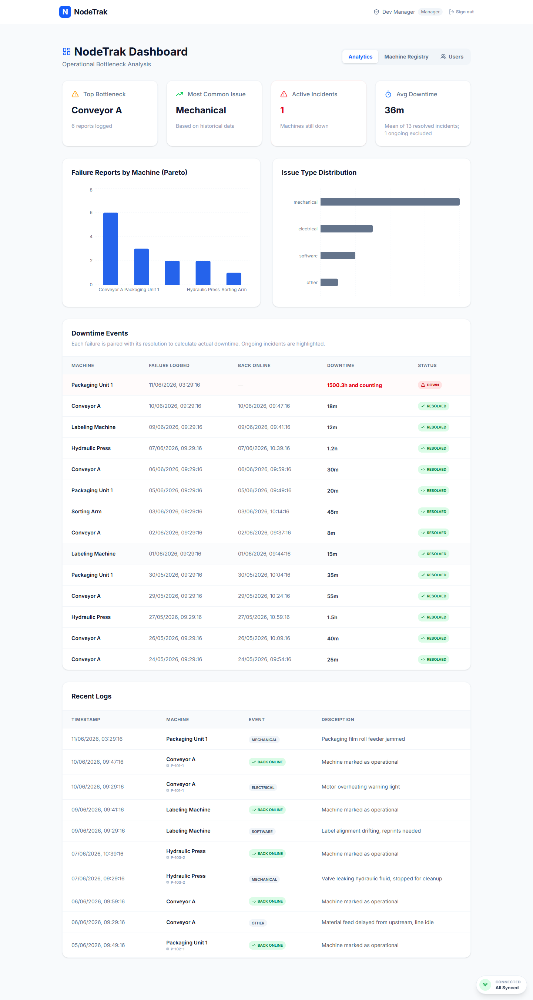
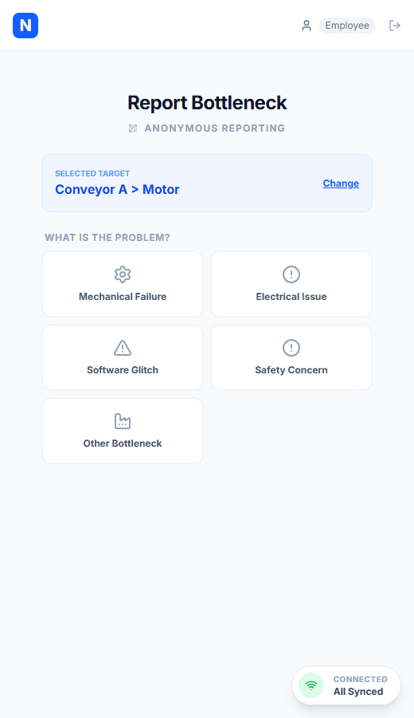
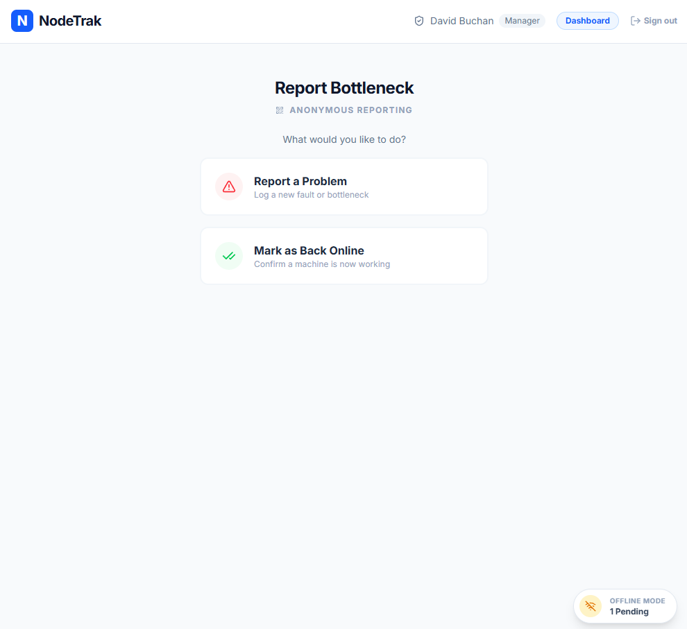
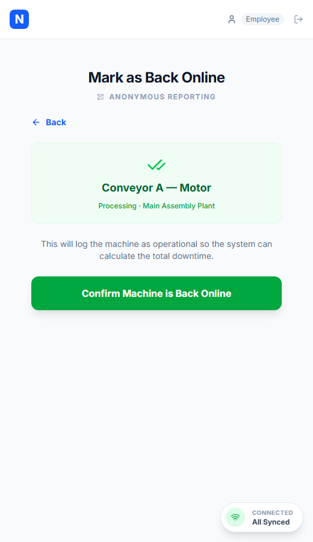
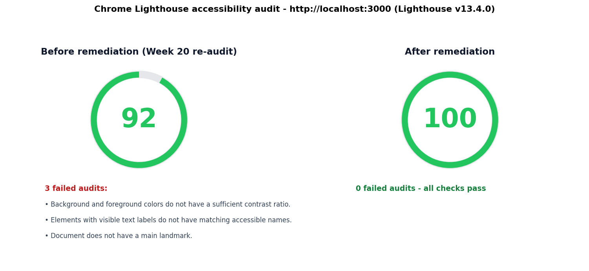

# David Buchan

### I build systems end-to-end

Data pipelines, automation tools, LLM integrations, and tested web applications. Every project in this portfolio is a complete system — inputs, transformations, feedback loops, failure handling, and a measurable output. Not one is a code snippet.

My background combines systems administration, financial-services analysis, manufacturing operations, and a BSc (Hons) in Computing and IT from The Open University. I am especially interested in integration engineering, data infrastructure, automation, and building the boring, reliable pieces that everything else depends on.

## NodeTrak, my final-year project

An offline-first Progressive Web App for anonymous factory-floor fault reporting. Workers report a fault without logging in, reports queue locally when the network is down, and everything syncs exactly once when connectivity returns. Managers get downtime analytics from the event stream.

| | | |
| --- | --- | --- |
|  |  |  |
|  |  | |

**Stack.** React and TypeScript front end, Express REST API, SQLite and IndexedDB storage, service-worker caching, Google OAuth 2.0.

**Quality.** The full test pyramid runs in CI on every push. Vitest for units, Supertest for the API, Playwright for end-to-end flows including offline queueing and duplicate-delivery prevention. Accessibility was tested with keyboard-only navigation and a screen reader.

The source is private while degree assessment completes. **The full repository publishes here once results are out, expected late 2026.**

## Featured work

| Project | What it demonstrates |
| --- | --- |
| [llm-contract](https://github.com/Reaver1000/llm-contract) | Schema-first structured extraction for LLM APIs. Feedback retries, provider abstraction for Claude and OpenAI, and a CI-safe eval harness. Tested, CI |
| [job-sweep](https://github.com/Reaver1000/job-sweep) | Multi-source remote job sweep pipeline. 20 sources, elimination-first filtering, Playwright bot-wall handling for Indeed, StepStone, and LinkedIn |
| [ETL Data Pipeline](https://github.com/Reaver1000/etl-data-pipeline) | Composable ETL framework with pluggable stages, schema mapping, deduplication, SQLite loading, tests, and CI |
| [Finance Dashboard](https://github.com/Reaver1000/finance-dashboard) | Full-stack analytics dashboard with TypeScript, React, PostgreSQL, REST APIs, and advanced SQL (CTEs, window functions) |
| [SQL Query Builder](https://github.com/Reaver1000/sql-query-builder) | Interactive Streamlit and DuckDB playground with 55 tested templates covering joins, windows, CTEs, cohorts, and RFM analysis |
| [Trip Orchestrator](https://github.com/Reaver1000/trip-orchestrator) | Multi-source travel research that ranks stays on unsponsored reviews (Bayesian-shrunk) and prices flexible date windows |
| [redditsbrainrot](https://github.com/Reaver1000/redditsbrainrot) | Automated video pipeline. Scraper, pluggable TTS stage (first ElevenLabs API, later Bark behind the same interface), subtitles, BGM, ffmpeg assembly |
| [Remote Job Engine](https://github.com/Reaver1000/remote-job-engine) | Polls 30+ job boards, scores roles for fit, and reports what the data says about the market. The honest lessons from this tool reshaped how I approach applications |
| [Data Analysis Demo](https://github.com/Reaver1000/data-analysis-demo) | Reproducible SQL and Python analysis pipeline with pandas, charts, customer segmentation, and automated reporting |
| [Futures Backtest Suite](https://github.com/Reaver1000/futures-backtest-suite) | Python research workflow with optimisation, parameter heatmaps, walk-forward validation, and reporting |
| [BookForge](https://github.com/Reaver1000/bookforge) | Programmatic printable book generator with a graded Sudoku engine, maze generation, journals, and planners. Tested, CI |
| [Prop Firm Toolkit](https://github.com/Reaver1000/prop-firm-toolkit) | Monte Carlo evaluation simulator, drawdown-guarded NinjaTrader strategy, and compliance cheat sheet. Live tool on GitHub Pages |
| [Python Automation Toolkit](https://github.com/Reaver1000/python-automation-toolkit) | File automation CLI with 20 tests and CI, stdlib only |

## Technical focus

**Languages.** Python, SQL, TypeScript, JavaScript

**Data.** pandas, DuckDB, SQLite, PostgreSQL, ETL, data visualisation, statistical analysis

**Application development.** React, Node.js, Express, REST APIs, Progressive Web Apps, offline-first design

**Testing and operations.** Vitest, Supertest, Playwright, CI, accessibility testing, OAuth 2.0, Linux, Docker, n8n, LLM API integration

## What I am looking for

Remote opportunities in data analysis, data engineering, backend or junior software engineering, test automation, technical support, or AI-assisted product development. I am based in Germany (Erfurt) and work comfortably with distributed teams across CET-friendly time zones.

## Background

- Computing and IT graduate, The Open University
- Former System Administrator
- Former Call Sourcing Analyst at Lloyds Banking Group
- Manufacturing operations experience at Amazon DSP
- English and German communication skills

## Connect

- [LinkedIn](https://www.linkedin.com/in/david-a-buchan/)
- [GitHub repositories](https://github.com/Reaver1000?tab=repositories)
